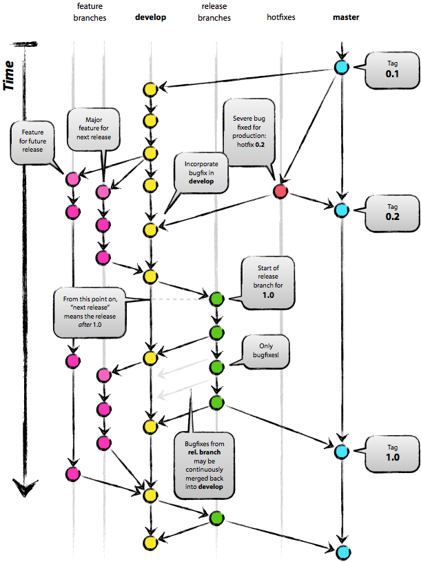

title: 從軟體工程角度反思自由軟體開發
output: index.html

--

<h1 style="font-size: 72px">
  從軟體工程角度 
  反思自由軟體開發
</h1>
 

## Denny Huang

--

### Who am I ?

 
<h2 style="font-size: 60px">
  <b>Denny Huang</b>
</h2>

* SITCON 2013, 2014 總召

* <a href="http://about.me/denny0223" target="_blank">About me</a>

--

### 開發經驗

* Java, C, PHP

* Bash shell

* Android

* 系統 / 網路 / 後端

--

### 緣起

 
<h2 style="font-size: 60px">
  <a href="http://www.openfoundry.org/tw/activities/details/396" target="_blank">
		HackGen Workshop -  
		歡迎來到 GitHub 新手村
  </a>
</h2>

--

 
<h2 style="font-size: 60px">
	銘傳大學 資管所 
	Oases Ong 
</h2>
 
<h2 style="font-size: 40px">
	Open Source Software 發展程序模型建構
</h2>

--

# 軟體工程？

--

 
<h2 style="font-size: 70px">
系統性 
規範化 
可定量的程序化方法
</h2>

	<a href="http://zh.wikipedia.org/zh-tw/%E8%BD%AF%E4%BB%B6%E5%B7%A5%E7%A8%8B" target="_blank">wiki</a>

--

* Request and Analysis Phase（需求與分析階段）

* Design Phase（設計階段）

* Coding Phase （撰寫階段）

* Testing Phase（測試階段）

* Maintenance Phase （維護階段）

--

<h1 style="font-size: 45px">
	Open Source project 的開發流程？
</h2>

--

# 系統 / 工具

--

- Mailing list
	- Google Groups
- IRC
	- ChatZilla / irssi / webchat
- Issue tracking system
	- GitHub
- Wiki
- Continuous integration service
	- Travis CI

--

# 版本控制

--

# Git

--

	
	<a href="http://nvie.com/posts/a-successful-git-branching-model/" target="_blank">src</a>

--

# 溝通工具

--

# Mailing list

--

 
<h2 style="font-size: 80px">
	<a href="https://groups.google.com" target="_blank">Google Groups</a> 
</h2>
 

	<a href="https://groups.google.com/forum/#!forum/sitcon-general" target="_blank">SITCON：日常</a> 
	<a href="mailto:sitcon-general@googlegroups.com">sitcon-general@googlegroups.com</a>

--

### 關於 Mail 的大小事

* 封存
* CC / BCC
* 引用
* 打招呼 **告訴別人你是誰** 結尾署名
* 設定 回覆所有人
* Lab 取消傳送
* 篩選器 / 標籤

--

# IRC

## #SITCON@freenode

--

### IRC Client

* [Irssi](http://www.irssi.org/)

* [ChatZilla](https://addons.mozilla.org/zh-TW/firefox/addon/chatzilla/)

* [Web](http://webchat.freenode.net/?channels=sitcon)

--

* [Registering your nick on freenode](http://freenode.net/faq.shtml#nicksetup)

* [Registering a channel on freenode](http://blog.freenode.net/2008/04/registering-a-channel-on-freenode/)

--

 
 
<h2 style="font-size: 60px">
	Request and Analysis Phase 
	需求與分析階段
</h2>

--

* 由於專案的人員身處各地，非同步化的討論是否會花費過多的時間？你的看法是甚麼？

--

* 參與專案的使用者若無具備軟體工程的基本概念，是否會導致溝通不良呢？你的看法是甚麼？

--

* 以傳統軟體工程的觀點，分析使用者的工作流程、習慣，整理成圖表，才能逐一地找出使用者的需求。 
所以，像OSS這樣無嚴謹化的需求分析真的能找出使用者的需求嗎？你的看法是甚麼？

	* [Feedly](http://feedly.uservoice.com/)
		* [成功案例](http://feedly.uservoice.com/forums/192636-suggestions/suggestions/3756882-export-my-rss-data-from-feedly)

--

<h1 style="font-size: 70px">
	Issue tracking system
</h1>

--

* GitHub

* [SITCON](http://staff.sitcon.org)
	* [repo](https://github.com/sitcon-tw/staff.sitcon.org)

* [Redmine](http://redmine.org)

* [GitLab](http://gitlab.org/)

* [Phabricator](http://phabricator.org/)

--

### SITCON

	

--

### Redmine

	

--

### Redmine

	

--

### Redmine

	

--

### GitLab

	

--

### GitLab

	

--

### Phabricator

	

--

<h1>
	<a href="https://github.com/denny0223/TOSW-test/issues" target="_blank">Demo</a>
</h1>
<h2>
	sample: <a href="https://github.com/rogerwang/node-webkit/issue" target="_blank">node-webkit</a>
</h2>

--

 
 
<h2 style="font-size: 60px">
	Design Phase 
	設計階段
</h2>

--

* 軟體的設計上是相當複雜的，所以採用簡單的架構，是否足夠?細部設計是由開發者自行設計或者仍需要溝通?如何溝通?

--

* 所設計的軟體架構的文件，能否充分表達設計概念？是否需要技術文件的附註？

--

# Wiki
## [Demo](https://github.com/denny0223/TOSW-test/wiki) / sample: [node-webkit](https://github.com/rogerwang/node-webkit/wiki)

--

* 軟體的環境會隨著技術的發展而變化，所以開發者如何因應？可否提出你的看法？

--

 
 
<h2 style="font-size: 60px">
	Coding Phase 
	撰寫階段
</h2>

--

* 傳統的程式開發會採用自上而下、自下而上等整合方法。在你的專案中是否會採用到上述的方法? 可否提出你的看法？

--

* 要reuse別人的程式碼到自己的專案中，這當中難道不會碰到結構上的問題嗎？如何處理？大部分reuse的程式碼需要修改嗎？還是只有部分的reuse的程式碼需要修改？

--

* OSS的開發者進行開發時，對於所使用的開發工具或環境熟練嗎？若從未接觸過，他們是如何上手的呢？

--

 
 
<h2 style="font-size: 60px">
	Testing Phase 
	測試階段
</h2>

--

* 專案中，是否有使用同僚覆核（peer review）的方式互相檢視專案人員的程式內容？

--

* 有人使用同僚覆核，需不需要其他動態的測試方法？若有，如何進行？沒有，又如何彌補這部分之不足？

--

# Testing
<h2>
<a href="https://github.com/denny0223/TOSW-test" target="_blank">Demo repo</a>
</h2>

--

# Continuous integration
<h2>
<a href="https://travis-ci.org/" target="_blank">Travis</a> / <a href="http://jenkins-ci.org/" target="_blank">Jenkins</a>
</h2>

--

### Jenkins

	

--

* OSS開發者是否會將軟體所出現錯誤進行分類？

--

* OSS專案在發展模式和經濟的因素下，不會擁有專門進行軟體測試的QA團隊。所以只會有幾個committer或甚至是一個管理者，這樣的方式會不會較不嚴謹，錯誤率會不會偏高?

--

 
 
<h2 style="font-size: 60px">
	Maintenance Phase 
	維護階段
</h2>

--

* 由於OSS軟體的版本釋出的時間相較於商業軟體是較短的，所以在這麼短的軟體發展生命週期裡，如何維護軟體的品質？是否較為困難？

--

* 開發者和使用者對於專案所發展的軟體，若沒有較宏觀的軟體架構的話，往後在系統整合或維護上是否相對困難？

--

* 由於非嚴謹的溝通和非標準的流程，是否會造成花費過多的時間？

--

 
 
<h2 style="font-size: 65px">
	動手練習實際付諸行動吧！
</h2>

--

<h1 style="font-size:72px">Thanks for listening</h1>

 

<h2 style="font-size: 18px">
本投影片採用<a href="http://creativecommons.org/licenses/by-sa/3.0/tw/" target="_blank">創用 CC「姓名標示—相同方式分享 3.0 台灣」授權條款</a>
</h2>
